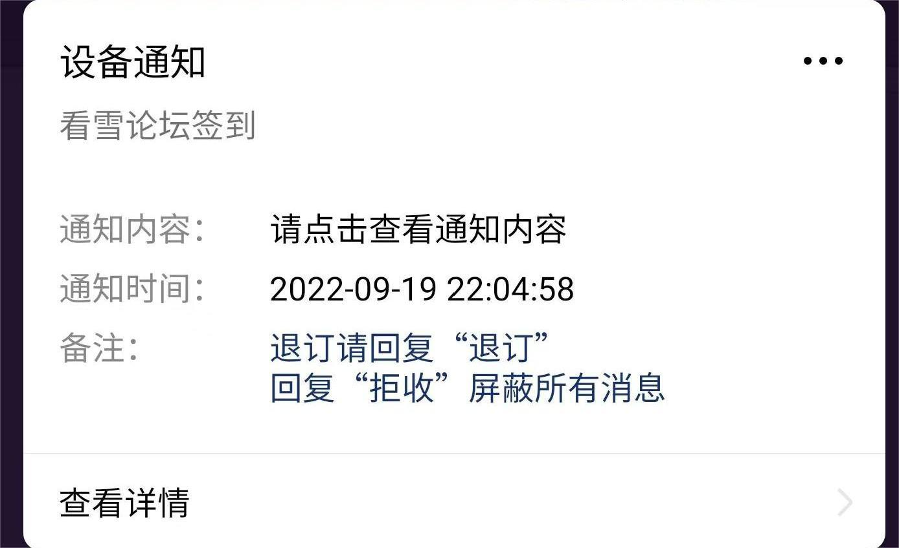
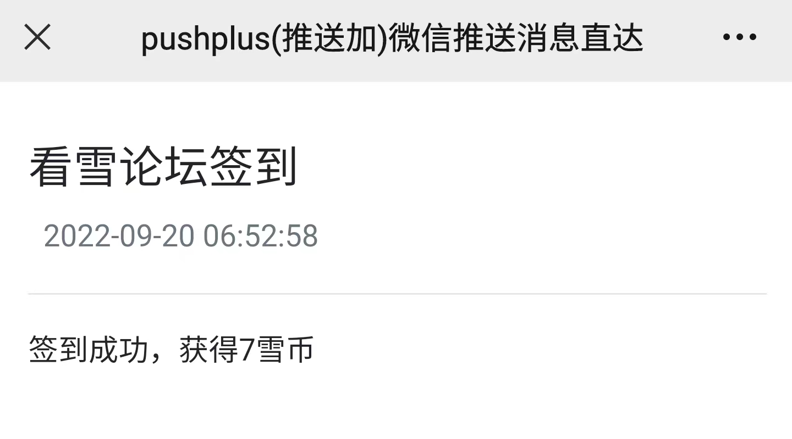
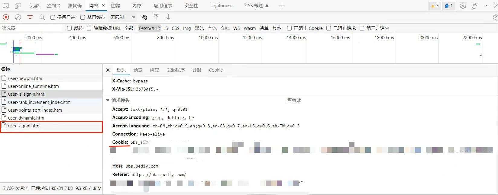
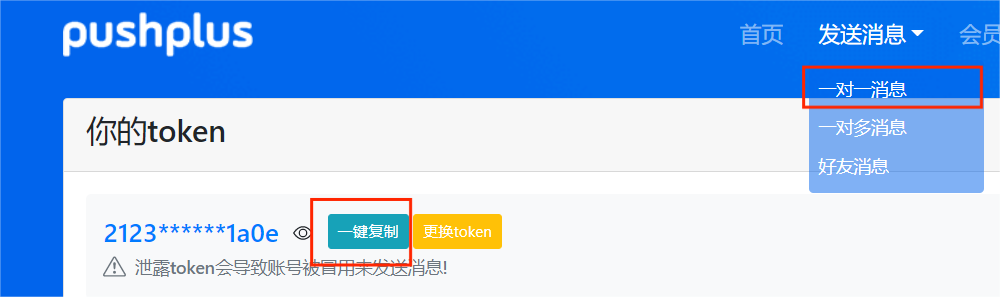
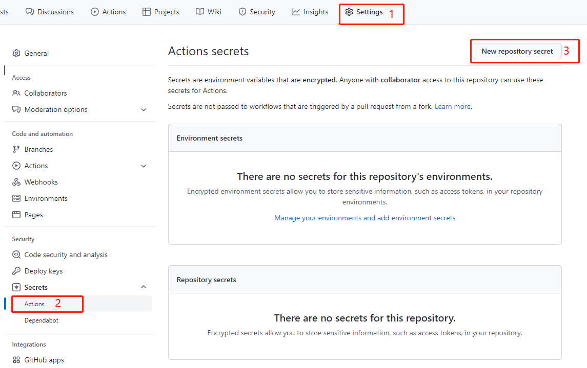
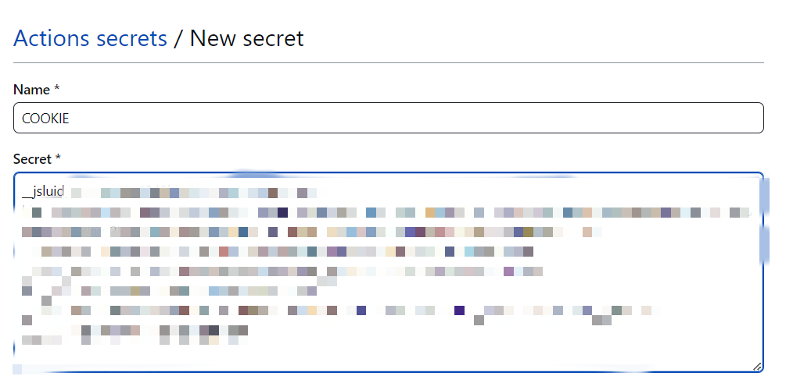
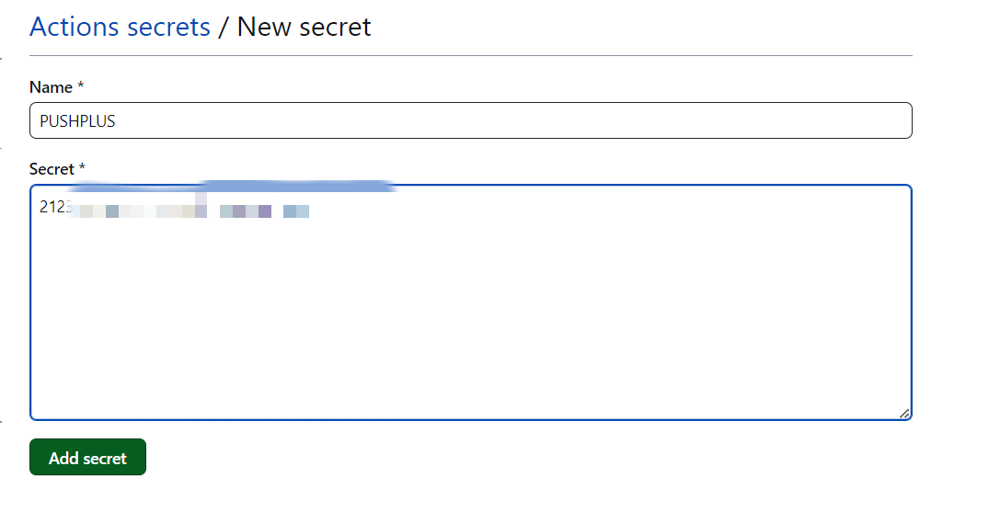
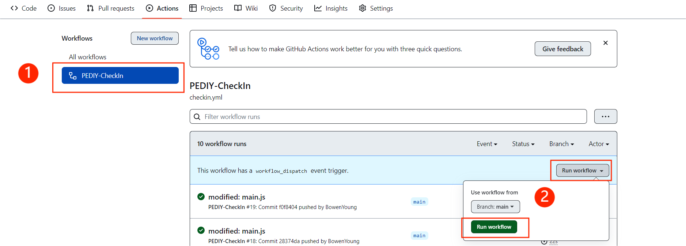

    <h1 align="center">pediyCheckIn</h1>

  
基于GitHub Actions的看雪论坛自动签到，可选推送与否

## 背景
[看雪论坛](https://bbs.pediy.com/)称得上是国内较好的安全论坛了。不过要1k雪币（论坛虚拟币，新用户几乎都可以获得220及以上）才可以升级为正式会员。临时会员有诸多限制，包括不能查看『WEB安全』版块等。对于我这种想白嫖的安全小白来说，唯一的方法就是每天签到随机获得1-10枚雪币。但是我经常会忘记签到，这等到猴年马月？这个脚本就是因此而诞生的。当然，除了升级正式会员，雪币还有许多用处，所以对已经是正式会员的用户来说也还算有些用罢。

## 特点

+ 基于[GitHub Actions](https://github.com/features/actions)，公开仓库使用零成本
+ 可用[pushplus](https://www.pushplus.plus/)推送签到消息到公众号（支持使用自己的公众号推送）
  
  

## 使用方法
### 获取看雪COOKIE
登录[看雪论坛](https://bbs.pediy.com/)，按`F12`打开控制台，点击网络(network)，点击Fetch/XHR(XHR)，再点击签到赚雪币，点击user-signin.htm，找到请求头(Request Header)中的Cookie，将后面的值复制下来保存好。

### 获取pushplus的token

**如果你不需要获知自动签到情况，你可以跳过这一步。**
登录[pushplus官网](https://www.pushplus.plus/login.html)，点击发送消息→一对一消息→一键复制，保存好。

### 仓库配置

首先点击右上角的fork，fork此仓库，配置随便填。接下来在你fork下来的仓库中进行操作。

#### 设置密钥

+ 配置看雪COOKIE
  `Name`填写: `COOKIE`
  `Value`处，将刚才在看雪论坛获取的COOKIE粘贴进去
  点击`Add secret`
  

+ 配置pushplus的token（不需要推送则不需要添加）
  `Name`填写: `PUSHPLUS`
  `Value`处，将刚才在pushplus官网一键复制的token粘贴进去
  点击`Add secret`
  

### 修改定时

1. 打开 `.github/workflows/checkin.yml`
2. 找到`cron`，修改 crontab表达式，可以参考[此处](https://crontab.guru/)。GitHub Actions用的是UTC时间，另外还有延迟，建议自己再试一下。

## 手动运行尝试

1. 点击`Actions`→`I understand my workflows, go ahead and enable them`
2. 点击`PEDIY-CheckIn`，再依次点击图中灰色和绿色的`run workflow`
   

等右边的加载圈圈变成绿色勾勾，证明工作流正常，可以点进去看详细信息。

### 接受推送消息（无需要则跳过）

扫描二维码关注pushplus公众号，签到消息会以推送方式呈现，目前亲测没有广告，偶尔有服务更新、维护等消息。
+ 2022-04-13，服务更新了支持绑定团队认证的公众号进行推送的功能。
+ 2024-08-01，需要实名才能接收消息。

## 作者
[@BeaCox](https://github.com/BeaCox)

## 支持
觉得本项目对你有所帮助，可以点击右上角star✨✨✨

